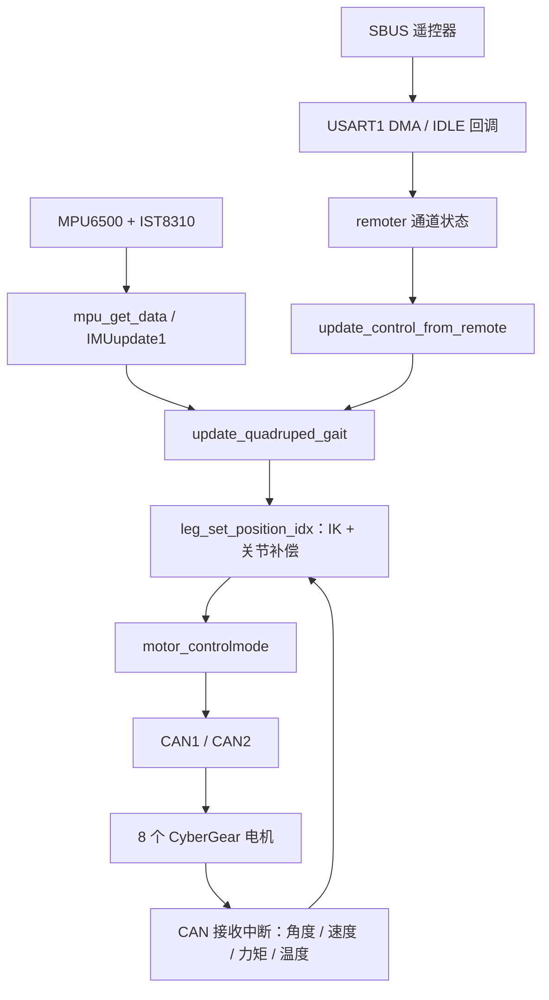

# Cybergear Mechanical DOG · 8 自由度并联四足机器人

面向 **2026 ROBOCON 竞赛备赛**的四足机器人项目，采用 **RoboMaster A 板、8 个小米 CyberGear 电机和双 CAN 总线**。每条腿由两个电机驱动，软件基于 STM32 HAL，通过 SBUS 遥控生成足端轨迹，并结合板载 IMU 做俯仰、横滚高度补偿。

本文以当前源码和 Keil 工程配置为准。参赛用途由项目作者提供，不表示已经完成赛事规则符合性验证或性能验收。

[代码逐层拆解与问题清单](docs/CODE_WALKTHROUGH.md) · [编译与上机检查](docs/BUILD_AND_BRINGUP.md) · [English](README.en.md)

## 当前实现

| 功能 | 当前代码状态 |
| --- | --- |
| 8 电机控制 | CAN1：ID 1–4；CAN2：ID 5–8，运控模式 |
| 遥控输入 | USART1 + DMA + IDLE，解析 10 个 SBUS 通道 |
| 行走 | 前后步幅、左右差动转向、原地踏步 |
| 步态 | 对角腿相差半周期，摆动相使用摆线轨迹，支撑相匀速回摆 |
| 姿态补偿 | MPU6500 + IST8310 → 四元数姿态解算 → 腿高补偿 |
| 关节控制 | 几何 IK、位置限幅、关节弹簧阻尼力矩补偿、电机内部 PD |
| VMC / 跳跃 | 存在实验文件，但未接入当前 Keil 编译目标和主循环 |
| 调度 | 裸机轮询，目标周期 10 ms；当前主程序未启动 FreeRTOS |

**当前版本属于开发代码快照。** 静态检查发现 SBUS DMA 缓冲区长度不一致、失联分支可继续读取旧指令、反馈角度与控制角度单位不一致等问题，详见[代码拆解](docs/CODE_WALKTHROUGH.md)。归档不代表固件已经通过编译或实机验证。

## 软件结构

```text
software/sizujixgou1123/
├── Core/                   STM32 初始化、主循环、中断入口
├── Drivers/                STM32F4 HAL、CMSIS 与芯片头文件
├── MDK-ARM/
│   ├── sizujixgou1123.uvprojx  Keil 工程入口
│   ├── CyberGear/          电机协议、反馈解析、CAN BSP
│   ├── SBUS/               遥控接收与解析
│   ├── leg/                当前步态、IK；另含实验性 VMC 等文件
│   ├── MPU6500/            IMU 读取、四元数姿态解算
│   ├── IST8310/            磁力计驱动、标量卡尔曼滤波
│   └── RTE/               配置及未接入的跳跃实验代码
└── sizujixgou1123.ioc      STM32CubeMX 配置
三维模型/                   机械设计资料
CyberGear微电机/            电机说明书、模型、固件等参考资料
docs/                       代码分析、编译与上机说明
```



## 硬件与电机映射

| 项目 | 当前源码配置 |
| --- | --- |
| 主控 | RoboMaster A 板，STM32F427IIHx |
| 时钟 | 外部时钟 12 MHz，SYSCLK 168 MHz，APB1 42 MHz |
| CAN1 | PD0 RX / PD1 TX；1 Mbit/s |
| CAN2 | PB12 RX / PB13 TX；1 Mbit/s |
| 遥控串口 | USART1，PB7 RX / PB6 TX，100000 baud，8 数据位 + 偶校验 + 2 停止位（HAL 配置为 9B 含校验） |
| 调试串口 | UART7，PE7 RX / PE8 TX，115200 baud，8N1 |
| 惯性传感器 | SPI5 连接 MPU6500，驱动同时读取 IST8310 |

CAN 位率由 `42 MHz / [3 × (1 + 9 + 4)] = 1 MHz` 推导。实际接线还应核对 A 板接口标识及收发器连接。

| 腿编号 | 源码约定位置 | 电机 ID | 总线 | 步态相位 |
| --- | --- | --- | --- | --- |
| 0 | 左前 LF | 1、2 | CAN1 | 0 |
| 1 | 左后 LH | 3、4 | CAN1 | 0.5 |
| 2 | 右后 RH | 5、6 | CAN2 | 0 |
| 3 | 右前 RF | 7、8 | CAN2 | 0.5 |

位置由姿态补偿分组与 VMC 头文件交叉核对，装配后仍须逐电机确认。右侧腿发送的位置和力矩取反；实际代码中 **0/2 同相，1/3 同相**，部分旧注释与此不一致。

## 遥控映射

以下 CH 编号从 1 开始，`ch[]` 下标从 0 开始。解析以原始值 992 为中心。

| 通道 | 数组下标 | 功能 |
| --- | --- | --- |
| CH1 | `ch[0]` | 转向步幅；死区 40，最终限幅 ±60 mm |
| CH3 | `ch[2]` | 前后步幅；死区 40，取反映射，限幅 ±90 mm |
| CH5 | `ch[4]` | 非零时允许前后/转向指令，零时清零两者 |
| CH6 | `ch[5]` | 大于 500 时原地踏步；当前独立于 CH5 |
| CH7 | `ch[6]` | 大于 500：抬腿 130 mm、周期 0.3 s；否则 60 mm、0.2 s |
| CH8 | `ch[7]` | 大于 500：190 mm；小于 −500：270 mm；中间：213.2 mm 基准高度 |

CH5 当前不是整机急停，关闭后仍发送站立命令，CH6 可以继续触发踏步。遥控器开关的实际输出须先通过通道监测确认。`side_s` 字段未进入当前轨迹计算，不能据此宣称支持横移。

## 编译入口与关键参数

打开 [Keil 工程](software/sizujixgou1123/MDK-ARM/sizujixgou1123.uvprojx)。工程记录的工具链为 ARMCC 5.05 update 1，器件包为 `Keil.STM32F4xx_DFP.2.17.0`。完整步骤见[编译与上机检查](docs/BUILD_AND_BRINGUP.md)。

| 参数 | 源码当前值 | 位置 |
| --- | --- | --- |
| 几何尺寸 | L1 = 100 mm，L2 = 200 mm，足端延长 = 45 mm | `leg/leg.h` |
| 角度偏置 | π/2 | `leg/leg.h` |
| 默认高度 / 抬腿高度 / 周期 | 213.2 mm / 60 mm / 0.2 s | `leg/leg.c` |
| 姿态补偿增益 | pitch、roll 均为 2 mm/° | `leg/leg.c` |
| 补偿限幅 / 变化率 | 每腿合成补偿 ±100 mm / 每轴 20 mm/s | `leg/leg.c` |
| 关节目标限幅 | 镜像前 −1.2～1.4 rad | `leg/leg.c` |
| 运控 PD | Kp = 13，Kd = 0.9 | `leg/leg.c` |

这些数值是源码参数，不是整机性能指标或本次测试的推荐参数。

## 后续开发重点

1. 修复接收越界、失联处理与反馈单位，建立明确的停机状态。
2. 统一左右腿坐标、关节方向和零位标定，修正 IK 可达域处理。
3. 测量控制周期，减少 CAN 重复发送与阻塞延时。
4. 修正姿态滤波状态共享，补充传感器有效性判断。
5. 在单腿测试通过后，验证完整并联机构的 FK / Jacobian 和 VMC。

## 仓库说明

源码、CubeMX/Keil 配置与机械资料用于协作维护。生成目标文件、历史构建产物、IDE 用户状态、重复的 `software.zip` 和第三方上位机运行包不纳入版本控制，本地文件保留。源码混有不同中文编码，本次文档整理不批量转码控制代码。

当前未为作者自有代码新增开源许可证；第三方 HAL、CMSIS 及电机驱动保留原有许可文件与作者声明。公开仓库不自动授予任意再分发许可。

远端原有的历史归档 `sizujixgou1123 (3).zip` 保留；阅读和后续开发以展开后的 `software/` 为准。
